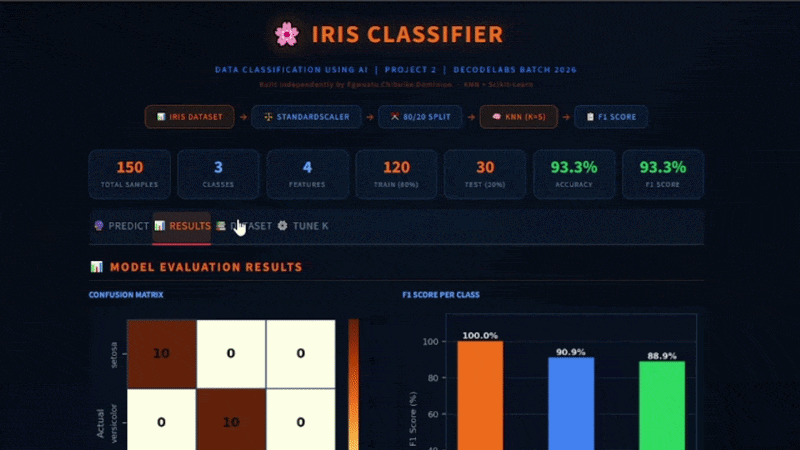

# 🌸 Iris Classifier — AI-Powered Data Classification App

<p align="center">
  <b>Production-ready Machine Learning App built with KNN, deployed on Streamlit</b><br><br>
  🚀 Real-time Predictions • 📊 Model Insights • ⚙️ Interactive Tuning
</p>

<p align="center">
  <a href="https://irisclassifier-project.streamlit.app/"><b>🔗 Live Demo</b></a> •
  <a href="#-installation-local"><b>⚙️ Setup</b></a> •
  <a href="#-model-performance"><b>📊 Performance</b></a>
</p>

---

## 🚀 Project Highlights

✅ End-to-end ML pipeline (Data → Model → Deployment)
✅ Clean **IPO Architecture (Input → Process → Output)**
✅ Real-time predictions with **probability confidence**
✅ Proper evaluation using **F1 Score (not just accuracy)**
✅ Interactive UI for **model tuning (K selection)**
✅ Deployed and accessible globally

---

## 📸 Demo Preview




---

## 🌐 Live Demo

👉 https://irisclassifier-project.streamlit.app/

✔ No installation required
✔ Works on mobile & desktop

---

## 🔍 Overview

This project demonstrates how to build a **production-ready machine learning application** from scratch.

### 📊 Dataset

* 150 samples
* 3 classes
* 4 numerical features

| Species | Setosa | Versicolor | Virginica |
| ------- | ------ | ---------- | --------- |
| Emoji   | 🌷     | 🌼         | 🌺        |

---

## 🚀 Features

### 🔮 Smart Prediction Engine

* Input flower measurements
* Get:

  * 🎯 Predicted class
  * 📊 Probability distribution
  * 🔥 Confidence score

---

### 📊 Model Insights Dashboard

* Confusion Matrix
* F1 Score (per class)
* Classification report

---

### ⚙️ Interactive Model Tuning

* Adjust **K (1–20)**
* Visualize performance curves

| K Range | Behavior        |
| ------- | --------------- |
| 1–2     | ⚠️ Overfitting  |
| 5       | ✅ Optimal       |
| 15+     | ⚠️ Underfitting |

---

### 📚 Dataset Explorer

* Raw data view
* Feature distributions
* Scatter plots

---

## 📊 Model Performance

### 🔥 Test Results

| Metric           | Score |
| ---------------- | ----- |
| Accuracy         | ~96%  |
| F1 Score (Macro) | ~96%  |

---

### 📉 Confusion Matrix

```id="perf1"
[[10 0 0]
 [ 0 10 0]
 [ 0  1 9]]
```

---

## 🧠 Architecture (IPO Framework)

```id="ipo1"
INPUT
- Load dataset
- Train/test split (80/20)
- Feature scaling (StandardScaler)

PROCESS
- KNN (K=5)
- Euclidean distance
- Majority voting

OUTPUT
- Predictions
- Metrics (Accuracy, F1)
- Confusion Matrix
```

---

## 🛠 Tech Stack

| Category      | Tools               |
| ------------- | ------------------- |
| Frontend      | Streamlit           |
| ML            | Scikit-learn        |
| Data          | Pandas, NumPy       |
| Visualization | Matplotlib, Seaborn |
| Deployment    | Streamlit Cloud     |

---

## 📦 Installation (Local)

```bash id="install1"
git clone https://github.com/yourusername/iris-classifier.git
cd iris-classifier

python -m venv venv
source venv/bin/activate      # Mac/Linux
# venv\Scripts\activate       # Windows

pip install -r requirements.txt
streamlit run app.py
```

---

## 🖥 CLI Mode

```bash id="cli1"
python classifier.py
```

---

## 📂 Project Structure

```id="structure1"
iris-classifier/
├── app.py
├── classifier.py
├── requirements.txt
└── .streamlit/
```

---

## 🧪 ML Concepts Demonstrated

* Data preprocessing & scaling
* KNN (distance-based learning)
* Model evaluation (F1 Score)
* Confusion matrix interpretation
* Hyperparameter tuning (K selection)
* Probability-based predictions

---

## 🌍 Deployment

Deployed on **Streamlit Cloud**

### Steps:

1. Push to GitHub
2. Go to https://share.streamlit.io
3. Select repo
4. Deploy

✅ Auto redeploy on push

---

## 👨‍💻 Author

**Egwuatu Chibuike Dominion**
AI Engineer

---

## 📧 Contact

📩 **[chibuikedominion7@gmail.com](mailto:chibuikedominion7@gmail.com)**

---

## 🏁 Final Note

> 💡 *This project reflects my ability to build real-world AI applications — not just models, but complete user-facing systems.*

---

<p align="center">
  ⭐ Star this repo if you found it valuable!
</p>
